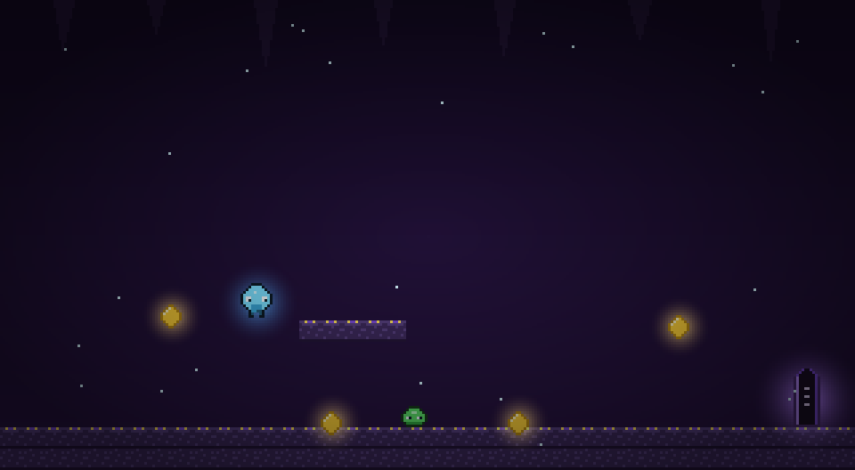

# Cristales de la Cueva

Un plataformero de acción con toques de metroidvania, hecho con **TypeScript + Vite +
Canvas**. Todo el arte está **dibujado por código** — ni un solo asset externo: cada
sprite es una grilla de píxeles con su paleta, y la atmósfera (rayos de luz, brasas,
niebla, parallax) se genera en tiempo real.



> Explorá la cueva, conseguí las habilidades, juntá los 5 cristales, vencé al guardián
> y escapá por la puerta — lo más rápido que puedas.

## Jugar

- **Demo en vivo:** _(pendiente de desplegar en Vercel)_
- **Local:**
  ```bash
  npm install
  npm run dev
  ```
  Abrí la URL que imprime Vite (normalmente `http://localhost:5173`).

## Qué tiene

- **Game feel** cuidado: coyote time, jump buffering, squash & stretch, hit-stop,
  sacudida de cámara, partículas y sonido (Web Audio API, sin archivos de audio).
- **Mundo por salas** conectadas (ASCII, un archivo por sala), con checkpoints,
  plataformas de un solo sentido, minimapa que se revela y fondo con parallax.
- **Habilidades** que abren zonas nuevas: doble salto, dash y wall jump, cada una
  detrás de una reliquia coleccionable.
- **Combate**: enemigos que patrullan, vuelan y persiguen; se los derrota pisándolos
  (tipo Mario); vida por corazones con knockback e invulnerabilidad; y un **jefe** que
  bloquea la salida hasta caer.
- **Estructura completa**: menú de inicio, pausa, game over y victoria; **récords
  guardados** en localStorage (mejor puntaje, mejor tiempo, veces completado) y un
  **cronómetro** para speedrun.
- **Teclado y gamepad**, con **prompts adaptativos**: los controles en pantalla cambian
  entre teclas y botones según el dispositivo que estés usando, al instante.

## Controles

| Acción            | Teclado           | Gamepad       |
| ----------------- | ----------------- | ------------- |
| Mover             | ← → / A D         | D-pad / stick |
| Saltar (¡doble!)  | espacio / ↑ / W   | A             |
| Dash              | shift / X         | X             |
| Pausa             | Esc / P           | Start         |
| Reiniciar         | R                 | Y             |
| Confirmar (menús) | Enter             | A / Start     |

## Build

```bash
npm run build     # revisa tipos y empaqueta a /dist (~14 kB gzip)
npm run preview   # sirve el build de producción
```

La carpeta `dist/` es estática: se publica gratis en **Vercel**, Netlify, itch.io o
GitHub Pages.

## Cómo está armado

- `src/engine/` — motor reutilizable (bucle de paso fijo, entrada teclado+gamepad,
  canvas/colisiones, `Sprite`, audio). No sabe nada de "cristales".
- `src/game/` — este juego en concreto: jugador, mundo, salas, enemigos, cámara y reglas.
- Las **salas** son texto ASCII en `src/game/rooms/` (un archivo por sala). Editá una,
  o creá la tuya y sumala a `rooms/index.ts`.
- El **arte** vive en `src/game/art.ts`: cada sprite es una grilla de texto con una
  paleta — cambiá un carácter y cambia un píxel. Ahí también están los brillos, el fondo
  con parallax, el polvo y la atmósfera.

## Hoja de ruta

Ver **[PLAN_DE_DESARROLLO.md](./PLAN_DE_DESARROLLO.md)**. Las 6 fases de desarrollo
(game feel → mundo más grande → habilidades → combate → arte → estructura) están
completas; queda publicar.
